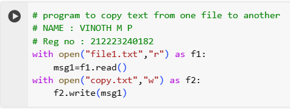

# Copy-File
## AIM:
To write a python program for copying the contents from one file to another file.
## EQUIPEMENT'S REQUIRED: 
PC
Anaconda - Python 3.7
## ALGORITHM: 
### Step 1:
open the text file that you want to copy
### Step 2: 
by using read function read the file 
### Step 3: 
now open the file that you want to store the copied text
### Step 4:  
by using write function write the file
### Step 5: 
now open the second file to see the copied text
## PROGRAM:
```
# program to copy text from one file to another
# NAME : VINOTH M P
# Reg no : 212223240182
with open("file1.txt","r") as f1:
    msg1=f1.read()
with open("copy.txt","w") as f2:
    f2.write(msg1)
```
### OUTPUT:



## RESULT:
Thus the program is written to copy the contents from one file to another file.
